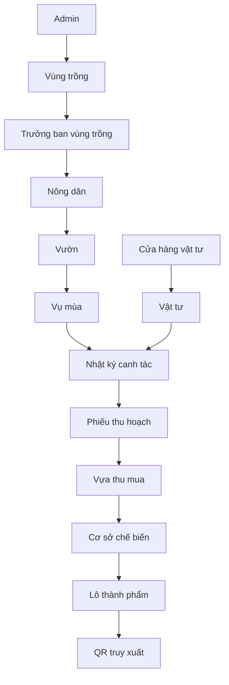

# TriViet — Nhật ký nông nghiệp và truy xuất nguồn gốc sầu riêng

TriViet là ứng dụng web quản lý chuỗi sản xuất sầu riêng từ vùng trồng, vườn, vụ mùa và nhật ký canh tác đến cung ứng vật tư, thu hoạch, thu mua, chế biến và truy xuất nguồn gốc.

Hệ thống phục vụ 6 nhóm người dùng: Quản trị viên (`ADMIN`), Trưởng ban vùng trồng (`AREA_MANAGER`), Nông dân (`FARMER`), Chủ cửa hàng vật tư (`STORE_OWNER`), Chủ vựa thu mua (`COLLECTOR`) và Cơ sở chế biến (`PROCESSING_FACILITY`).

Phạm vi đã triển khai tốt nhất hiện nay là quản lý tài khoản, vùng trồng, vườn, vụ mùa, nhật ký, vật tư, cửa hàng, kho, đơn hàng và phiếu thu hoạch. Luồng thu mua dùng dữ liệu thật từ phiếu thu hoạch; phần lô nguyên liệu, chế biến, thành phẩm và QR đang ở mức MVP và cần tiếp tục chuẩn hóa persistence.

## Luồng nghiệp vụ tổng quát



Luồng vụ mùa của nông dân:

```text
Vườn → Vụ mùa → Nhật ký → Thu hoạch → Đóng vụ → Vụ mới
```

## Actor và chức năng chính

| Actor | Chức năng chính |
|---|---|
| Admin | Quản lý tài khoản, vùng trồng, phân công trưởng ban, master data, phê duyệt và giám sát |
| Trưởng ban vùng trồng | Duyệt nông dân trong vùng được giao, quản lý vườn, rà soát nhật ký và xử lý tuân thủ |
| Nông dân | Quản lý vườn, vụ mùa, nhật ký, kế hoạch, vật tư, sâu bệnh, thu hoạch và chi phí |
| Chủ cửa hàng vật tư | Quản lý cửa hàng, sản phẩm, kho, chứng từ, đơn hàng, thanh toán và tài chính |
| Chủ vựa thu mua | Xác nhận phiếu thu hoạch, nhận hàng, theo dõi nguồn hàng, lô và tài chính tổng hợp |
| Cơ sở chế biến | Theo dõi nguyên liệu, QC, lô chế biến, thành phẩm và trạng thái QR ở mức MVP |

## Phạm vi chức năng

### Admin

- Quản lý tài khoản và trạng thái phê duyệt theo vai trò.
- Quản lý vùng trồng, trạng thái vùng và phân công trưởng ban.
- Theo dõi hồ sơ vườn, canh tác và lịch sử phê duyệt.
- Quản lý giống, giai đoạn, hoạt động, phân bón, thuốc BVTV và hóa chất cấm.
- Quản lý hồ sơ cửa hàng và cơ sở đối tác.
- Chỉ ghi đè quy trình duyệt nông dân khi có lý do nghiệp vụ.

### Trưởng ban vùng trồng

- Chỉ truy cập vùng trồng được phân công trong database.
- Duyệt, yêu cầu bổ sung hoặc từ chối hồ sơ nông dân.
- Theo dõi vườn và nhật ký trong phạm vi quản lý.
- Cảnh báo, yêu cầu sửa nhật ký/kiểm tra vườn, tạm ngưng hoặc kích hoạt lại vườn.
- Theo dõi lịch sử trạng thái vườn và gửi thông báo cho nông dân.

### Nông dân

- Quản lý một hoặc nhiều vườn và vụ mùa theo từng vườn.
- Ghi nhật ký theo giai đoạn, hoạt động, phân bón, thuốc BVTV và lượng vật tư.
- Quản lý kho vật tư cá nhân; đồng bộ vật tư từ đơn mua hoàn tất.
- Theo dõi sâu bệnh, bẫy, kiểm tra và biện pháp xử lý.
- Lập kế hoạch, ghi nhận thời tiết, tạo phiếu thu hoạch.
- Theo dõi chi phí và thống kê canh tác.

### Chủ cửa hàng vật tư

- Quản lý hồ sơ, sản phẩm phân bón, thuốc BVTV và thiết bị.
- Quản lý tồn kho bằng chứng từ nhập/xuất và lịch sử biến động.
- Tiếp nhận, cập nhật trạng thái và thanh toán đơn hàng.
- Theo dõi doanh thu, giá vốn, lợi nhuận và công nợ.

### Chủ vựa thu mua

- Nhận và phản hồi phiếu thu hoạch do nông dân gửi.
- Theo dõi lịch thu mua, khối lượng dự kiến và giao nhận.
- Theo dõi nguồn hàng theo vườn và phiếu thu hoạch.
- Xem lô hàng và số liệu tài chính tổng hợp hiện có.

### Cơ sở chế biến

- Tiếp nhận nguồn nguyên liệu từ phiếu thu hoạch được chỉ định.
- Theo dõi kiểm tra đầu vào, lô nguyên liệu, lô chế biến và thành phẩm trong luồng MVP.
- Theo dõi điều kiện bảo quản và trạng thái QR.

> `RawMaterialLot`, `ProcessingBatch` và `FinishedProductLot` hiện là mô hình nghiệp vụ trong mã ứng dụng, chưa phải bảng Prisma độc lập. QC, chế biến và phát hành QR chưa phải quy trình persistence hoàn chỉnh.

## Ma trận vai trò và quyền hạn

| Chức năng | Admin | Trưởng ban | Nông dân | Cửa hàng | Thu mua | Chế biến |
|---|:---:|:---:|:---:|:---:|:---:|:---:|
| Quản lý vùng trồng | CRUD | Vùng được giao | Xem liên quan | Không | Xem nguồn | Xem nguồn |
| Phân công trưởng ban | CRUD | Không | Không | Không | Không | Không |
| Duyệt nông dân | Ghi đè có lý do | Trong vùng | Không | Không | Không | Không |
| Quản lý vườn | Giám sát | Trong vùng | Vườn sở hữu | Không | Xem nguồn | Xem nguồn |
| Vụ mùa và nhật ký | Kiểm tra | Rà soát | CRUD | Không | Xem truy xuất | Xem truy xuất |
| Sản phẩm cửa hàng | Kiểm tra | Không | Mua | CRUD | Không | Không |
| Kho cửa hàng | Kiểm tra | Không | Không | CRUD | Không | Không |
| Phiếu thu hoạch | Kiểm tra | Theo dõi | CRUD | Không | Xử lý được giao | Xử lý được giao |
| Chế biến/thành phẩm | Kiểm tra | Không | Không | Không | Không | MVP |

Quyền phải được kiểm tra tại Server Component, API hoặc service. Ẩn nút trên UI không phải là cơ chế phân quyền.

## Mô hình dữ liệu cốt lõi

```text
User
├── AreaManagerApplication
├── AreaManagerRegionAssignment ── GrowingRegion
├── Farm (Farmer)
├── Store (Store Owner)
└── PartnerFacility (Collector / Processing Facility)

GrowingRegion
└── Farm
    ├── GardenStatusHistory
    ├── CropSeason
    │   └── FarmingLog
    │       └── FarmingLogMaterial
    ├── FarmingPlan
    ├── WeatherObservation
    ├── PestMonitoringBook
    └── HarvestRecord
        ├── HarvestVarietyItem
        └── HarvestStatusHistory

Store
├── StoreProduct
├── InventoryDocument
├── InventoryMovement
└── Order
    ├── OrderItem
    └── OrderStatusHistory
```

Mô hình đích của chuỗi truy xuất:

```text
Farm → CropSeason → FarmingLog → HarvestLot → ProcurementOrder
→ GoodsReceipt → CollectionLot → RawMaterialLot
→ ProcessingBatch → FinishedProductLot
```

Các entity từ `HarvestLot` trở về sau đang nằm trong roadmap chuẩn hóa, chưa phải toàn bộ đã được persistence.

## Luồng truy xuất nguồn gốc

Mục tiêu là cho phép truy ngược:

```text
Thành phẩm → Mẻ chế biến → Lô nguyên liệu → Lô thu mua / Phiếu thu hoạch
→ Vườn → Vụ mùa → Nhật ký → Phân bón / Thuốc BVTV
→ Cửa hàng / Lô sản phẩm
```

Hiện hệ thống truy được từ phiếu thu hoạch về vườn, nông dân và dữ liệu canh tác. Liên kết thành phẩm → mẻ chế biến → lô nguyên liệu và snapshot vật tư cần hoàn thiện trước khi dùng làm hồ sơ truy xuất chính thức.

## Công nghệ

| Thành phần | Công nghệ |
|---|---|
| Frontend | Next.js 14.2 App Router, React 18 |
| Ngôn ngữ | TypeScript 5.6 |
| UI | Tailwind CSS 3.4, Lucide React, Recharts, component nội bộ |
| Backend | Next.js Route Handlers và Server Components |
| ORM / Database | Prisma 5.22 / PostgreSQL |
| Xác thực | NextAuth Credentials, JWT, bcryptjs; có fallback JWT nội bộ |
| Validation | Zod, react-hook-form |
| Offline/PWA | Service Worker, manifest, IndexedDB (`idb`) |
| Quét mã | ZXing; phát hành QR thành phẩm đang ở mức MVP |
| File storage | Filesystem cục bộ `.storage` |
| AI tùy chọn | Google Gemini cho gợi ý thời tiết |
| Deployment | Vercel; production build chạy Prisma migration |

## Cấu trúc dự án

```text
.github/workflows/        GitHub Actions CI
docs/                     Tài liệu vận hành
prisma/
├── migrations/           Lịch sử migration
├── schema.prisma         Schema PostgreSQL
└── seed.ts               Dữ liệu khởi tạo/demo
public/                   Static assets và PWA
scripts/                  Import, backfill và seed theo module
src/
├── app/
│   ├── api/               API theo nghiệp vụ
│   ├── dashboard/         Giao diện theo actor
│   └── region-manager/    Quản lý nông dân/vườn theo vùng
├── components/            UI và component nghiệp vụ
├── lib/                   Auth, Prisma, service và business helper
└── types/                 Kiểu TypeScript dùng chung
.storage/                 File upload cục bộ, không commit
middleware.ts             Bảo vệ route dashboard theo role
```

## Xác thực và phân quyền

Role trong Prisma:

```text
ADMIN
AREA_MANAGER
FARMER
STORE_OWNER
COLLECTOR
PROCESSING_FACILITY
```

- Đăng nhập bằng số điện thoại hoặc email và mật khẩu.
- Mật khẩu được băm bằng `bcryptjs`; session chính dùng NextAuth Credentials với JWT.
- Middleware bảo vệ dashboard chính; từng page/API tiếp tục kiểm tra session, role, trạng thái duyệt và phạm vi sở hữu.
- Trưởng ban lấy phạm vi từ `AreaManagerRegionAssignment`, không dựa vào JSON hồ sơ để quyết định quyền.
- Tài khoản chưa duyệt, bị khóa hoặc dữ liệu ngoài phạm vi không được phép thao tác.

## Workflow chính

### Đăng ký nông dân

```text
Đăng ký và khai báo vườn → Khớp vùng trồng → Thông báo trưởng ban
→ Rà soát → Duyệt / bổ sung / từ chối → Cho phép vận hành
```

### Vụ mùa và nhật ký

```text
Chọn vườn → Kiểm tra vụ ACTIVE → Bắt đầu vụ mới nếu cần
→ Ghi nhật ký, vật tư, sâu bệnh và kế hoạch → Thu hoạch → Đóng vụ
```

Nếu chỉ có một vườn, hệ thống tự chọn vườn. Tên vụ dùng năm thu hoạch mục tiêu, có thể khác năm bắt đầu.

### Mua vật tư

```text
Nông dân đặt hàng → Cửa hàng xác nhận → Chứng từ xuất kho
→ Giao hàng → Hoàn tất/thanh toán → Đồng bộ FarmerSupply
```

Đơn bị hủy hoặc từ chối không được tính vào doanh thu/lợi nhuận thực tế.

### Thu hoạch và thu mua

```text
Nhật ký → Tạo phiếu thu hoạch → Chọn đơn vị mua
→ Xác nhận hoặc từ chối → Thu hoạch và giao nhận → Hoàn tất
```

### Chế biến và QR

```text
Nguồn thu hoạch → Kiểm tra nguyên liệu → Lô nguyên liệu
→ Mẻ chế biến → Lô thành phẩm → Phát hành QR
```

Workflow này hiện là MVP hiển thị từ `HarvestRecord`; cần bảng và API giao dịch trước khi dùng trong production.

## Database và Prisma

Yêu cầu: Node.js 20 khuyến nghị, npm 9+ và PostgreSQL tương thích.

```bash
npm install
npm run db:start
npm run prisma:generate
npm run prisma:migrate
npm run seed
npm run dev
```

Docker Compose ánh xạ PostgreSQL ra host port `5433`. Production/staging chỉ triển khai migration đã commit:

```bash
npm run prisma:migrate:deploy
```

Không dùng `prisma db push` thay migration trong production.

## Biến môi trường

Sao chép [`.env.example`](.env.example) thành `.env.local` và cấu hình:

```env
DATABASE_URL=
NEXTAUTH_URL=
NEXTAUTH_SECRET=
AUTH_JWT_SECRET=
STORE_DOCUMENT_SIGNING_SECRET=
GEMINI_API_KEY=
GEMINI_MODEL=
```

Hai biến Gemini chỉ cần khi bật gợi ý thời tiết bằng AI. Không commit secret hoặc connection string thật.

## Chạy tại máy

```bash
git clone https://github.com/HongLinh1103/durian-traceability-system.git
cd durian-traceability-system
npm install
```

macOS/Linux:

```bash
cp .env.example .env.local
```

PowerShell:

```powershell
Copy-Item .env.example .env.local
```

Sau đó chạy các lệnh database ở phần trên và mở [http://localhost:3000](http://localhost:3000).

Kiểm tra trước khi gửi thay đổi:

```bash
npm run typecheck
npm run lint
npm run build
```

## Tài khoản demo

Chỉ dùng cho phát triển/demo; không dùng các mật khẩu này trong production.

| Vai trò | Email / số điện thoại | Mật khẩu | Seed |
|---|---|---|---|
| Admin | `admin@triviet.vn` / `0348110676` | `Admin@123` | `npm run seed` |
| Trưởng ban | `truongban.trian@triviet.vn` / `0909123456` | `Truongban@123` | `npm run seed` |
| Nông dân | `farmer@triviet.vn` / `0912345678` | `123456` | `npm run seed:role-accounts` |
| Chủ cửa hàng | `store.owner@triviet.vn` / `0909000001` | `123456` | `npm run seed:store-demo` |
| Chủ vựa | `collector@triviet.vn` / `0909000002` | `ThuMua@123` | `npm run seed:role-accounts` |
| Cơ sở chế biến | `processing@triviet.vn` / `0909000003` | `CheBien@123` | `npm run seed:role-accounts` |

## Trạng thái hiện tại

| Module | Trạng thái | Ghi chú |
|---|---|---|
| Xác thực và phân quyền | Hoàn thành | NextAuth/JWT, role và kiểm tra backend |
| Vùng trồng | Hoàn thành | Trạng thái vùng và phân công trưởng ban |
| Nông dân/vườn | Hoàn thành | Phê duyệt theo phạm vi, lịch sử trạng thái |
| Vụ mùa và nhật ký | Hoàn thành | Nhật ký gắn vụ mùa/vườn |
| Kế hoạch, thời tiết, sâu bệnh | Hoàn thành | Có persistence |
| Cửa hàng và marketplace | Hoàn thành | Sản phẩm, giỏ hàng, đơn hàng |
| Kho và tài chính cửa hàng | Hoàn thành | Chứng từ, biến động, doanh thu, thanh toán |
| Thu hoạch/thu mua | Một phần | Phiếu thật; nghiệp vụ lô cần chuẩn hóa |
| Chế biến | MVP | Lô được suy ra, chưa persistence độc lập |
| QR đầu-cuối | Một phần | Chưa có snapshot lineage đầy đủ |
| Lưu file production | Một phần | Cần object storage |

## Giới hạn đã biết

- Chưa có đầy đủ `ProcurementOrder`, `GoodsReceipt` và `CollectionLot` độc lập.
- `HarvestRecord` đang kiêm nhiều trách nhiệm của phiếu nguồn, giao nhận và lô.
- Lô nguyên liệu, mẻ chế biến và thành phẩm đang được dựng trong runtime.
- QC chưa có workflow, bằng chứng và lịch sử phê duyệt hoàn chỉnh.
- Chuỗi truy xuất chưa snapshot vật tư/lô sản phẩm tại thời điểm sử dụng.
- `StoreProduct` chưa liên kết đầy đủ master product và product batch.
- File upload nằm trên `.storage`; filesystem Vercel không phù hợp để lưu bền vững.
- Hệ thống chưa dùng WebSocket; phần lớn màn hình cần reload/revalidation để nhận dữ liệu mới.
- Cần tiếp tục đồng nhất middleware và kiểm tra quyền ở mọi route đối tác.

## Roadmap

### Giai đoạn 1 — Nền tảng

- Chuẩn hóa approval theo role và audit phân công vùng.
- Hoàn thiện master product và product batch.

### Giai đoạn 2 — Thu hoạch và thu mua

- Tách `HarvestLot`; bổ sung `ProcurementOrder`, `GoodsReceipt`, `CollectionLot`.
- Hoàn thiện cân thực tế, sai lệch, giao nhận và công nợ thu mua.

### Giai đoạn 3 — Chế biến

- Persistence cho `RawMaterialLot`, `ProcessingBatch`, `FinishedProductLot`.
- Workflow QC, bằng chứng, hao hụt, đóng gói, kho lạnh và xuất lô.

### Giai đoạn 4 — Truy xuất và vận hành

- QR đầy đủ từ thành phẩm về nhật ký/vật tư và snapshot lineage.
- Audit log, cảnh báo tuân thủ, object storage và cập nhật gần thời gian thực.

## Tổng quan API

| Nhóm | Phạm vi |
|---|---|
| `/api/auth/*` | Đăng nhập, session, đăng ký actor |
| `/api/admin/*` | Tài khoản, vùng, phân công, cửa hàng, canh tác, master data |
| `/api/region-manager/*` | Nông dân, vườn và hành động theo vùng |
| `/api/farming-logs`, `/api/crop-seasons` | Vụ mùa và nhật ký |
| `/api/farmer/*` | Thống kê, chi phí, vật tư, sâu bệnh |
| `/api/farming-plans`, `/api/weather*` | Kế hoạch và thời tiết |
| `/api/harvests/*` | Phiếu thu hoạch và trạng thái |
| `/api/store/*` | Hồ sơ, sản phẩm, kho, đơn hàng, tài chính |
| `/api/orders/*`, `/api/cart` | Luồng mua hàng nông dân |
| `/api/partners` | Đơn vị thu mua/chế biến phù hợp |
| `/api/health` | Ứng dụng và kết nối database |

API chi tiết sẽ được tách thành `docs/API.md` khi hợp đồng API ổn định.

## Tài liệu

- [Checklist sẵn sàng production](docs/production-readiness.md)
- [Prisma schema](prisma/schema.prisma)
- [Migration database](prisma/migrations)
- [Biến môi trường mẫu](.env.example)

Tài liệu chuyên sâu dự kiến: `ARCHITECTURE.md`, `DATABASE.md`, `BUSINESS_FLOW.md`, `ROLES_AND_PERMISSIONS.md`, `API.md` và `DEPLOYMENT.md` trong `docs/`.

## Lưu ý triển khai

- Vercel build chạy `prisma generate`, `prisma migrate deploy` và `next build` qua `vercel-build`.
- Sao lưu database và kiểm tra migration trước khi đưa lên production.
- Thay toàn bộ secret và mật khẩu demo ở môi trường thật.
- Không dựa vào `.storage` để lưu hồ sơ lâu dài trên Vercel.
- Kiểm tra `/api/health` sau mỗi lần triển khai.
